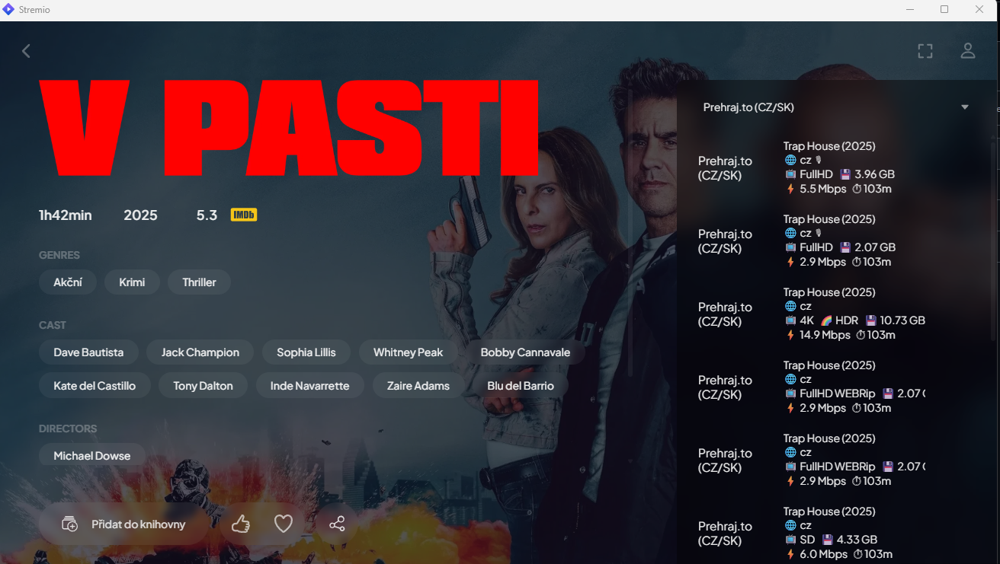
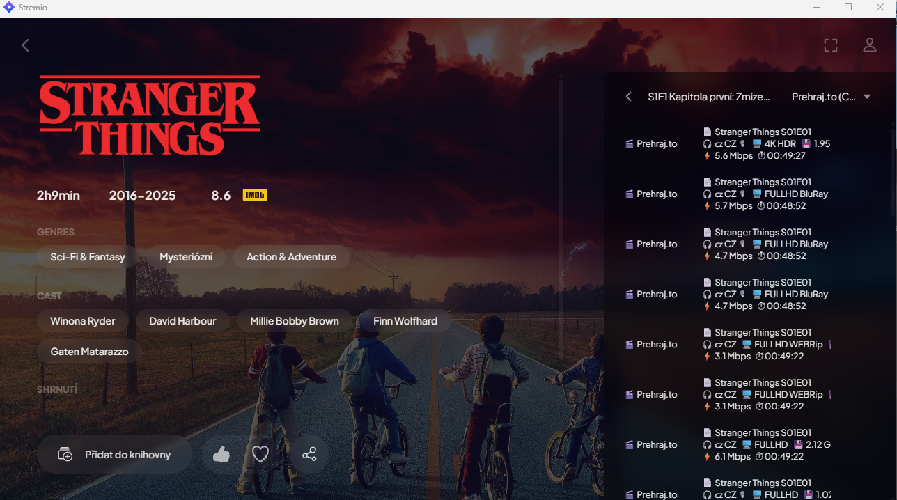

# Prehraj.to Stremio Addon (CZ/SK)

## O projekte

Tento projekt je **komunitný doplnok pre Stremio**, ktorý prepája Stremio s webom **https://prehrajto.cz**. Jeho úlohou je nájsť a sprostredkovať **priame video streamy** (filmy aj seriály) z Prehraj.to priamo do Stremia – bez potreby manuálneho vyhľadávania v prehliadači.

Doplnok funguje ako „most“ medzi:
- **Cinemeta / TMDb (IMDB ID)** – odkiaľ Stremio získa názov, rok, sezónu a epizódu
- **prehrajto.cz** – kde sa reálne nachádzajú video súbory

Inšpiráciou pre vznik tohto doplnku bol:
- pôvodný **KODI doplnok pre prehraj.to**
- vizuálny a informačný štýl doplnku **Hellspy** (prehľadné streamy, ikony, technické info)

---

## Funkcie doplnku

- 🎬 **Filmy** – vyhľadávanie podľa názvu a roka
- 📺 **Seriály** – plná podpora epizód (S01E01, 1x01, párovanie podľa IMDB → TMDb)
- 🔎 **Automatické vyhľadávanie** na prehrajto.cz
- 🔗 **Priame video URL** (žiadne medzistránky)
- 🇨🇿 🇸🇰 **Rozpoznanie jazyka** (CZ / SK / EN, dabing, titulky)
- 🖥️ **Rozpoznanie kvality** (4K, FULLHD, HD, SD)
- 🌈 **Rozpoznanie formátu** (HDR, BluRay, WEB-DL, WEBRip, REMUX)
- 💾 **Veľkosť súboru**
- ⚡ **Odhadovaný bitrate (Mbps)**
- ⏱ **Dĺžka videa**
- 🔥 **Inteligentné triedenie streamov**:
  - najprv kvalita (4K → FULLHD → HD)
  - potom formát (HDR / BluRay / WEB-DL)
  - až následne veľkosť a bitrate
- 🎨 **Hellspy-like zobrazenie** (viacriadkový blok s ikonami)
- 🧠 **Cache** – menej requestov, rýchlejšie odpovede

---

## Lokálna inštalácia (vývoj / testovanie)

> Tento repozitár je nastavený na **lokálne používanie**. Pri nasadení na cloud (Render/VPS) vie prehrajto.cz často vracať „protection page“, takže scraping potom zlyhá a streamy budú prázdne.

Doplnok je navrhnutý tak, aby sa dal **spúšťať lokálne** na tvojom počítači a testovať priamo v Stremiu.

### Požiadavky
- Node.js (odporúčané LTS)
- npm

### Inštalácia závislostí

V koreňovom priečinku projektu spusti:

```bash
npm install
```

Použité závislosti:
- `stremio-addon-sdk` – API a server pre Stremio addon
- `axios` – HTTP requesty
- `cheerio` – parsovanie HTML (scraping prehrajto.cz)

---

## Spustenie lokálneho servera

Addon sa spúšťa ako lokálny HTTP server:

```bash
npm start
```
alebo:
```bash
node index.js
```

Po spustení sa v termináli zobrazí:
- URL manifestu
- debug správy (vyhľadávanie, epizódy, chyby requestov atď.)

Typicky:
```
🚀 Prehraj.to addon beží na http://127.0.0.1:7001
📄 Manifest: http://127.0.0.1:7001/manifest.json
```

---

## Inštalácia doplnku v Stremio (lokálne)

1. Spusť addon (`npm start`)
2. Otvor **Stremio**
3. Choď do **Add-ons → Community Add-ons → Install via URL**
4. Vlož:
   ```
   http://127.0.0.1:7001/manifest.json
   ```
5. Potvrď inštaláciu

Od tejto chvíle sa budú pri filmoch a seriáloch v Stremiu zobrazovať streamy z Prehraj.to.

---

## Autentifikácia / login na prehrajto.cz

❌ **Nie je potrebný žiadny účet ani prihlásenie**.

Addon funguje rovnako ako pôvodný KODI doplnok v „free“ režime:
- nepoužíva cookies
- nerieši premium download
- nevyžaduje login ani API kľúč pre prehrajto.cz

Všetky streamy sú získavané z verejne dostupných stránok.

---

## Online testovanie (krok za krokom)

1. Spusti addon lokálne (`npm start`)
2. Over funkčnosť manifestu v prehliadači:
   - `http://127.0.0.1:7001/manifest.json`
3. Nainštaluj addon v Stremiu (Install via URL)
4. Otvor film alebo epizódu seriálu
5. V zozname streamov uvidíš **Prehraj.to (CZ/SK)** položky
6. Vyber stream – prehrávanie začne okamžite
7. Ak niečo nefunguje, sleduj terminál – zobrazujú sa tam debug informácie

---

## Poznámka

Tento projekt je určený **na vzdelávacie a experimentálne účely**. Používateľ je zodpovedný za dodržiavanie platnej legislatívy vo svojej krajine.

---

## Screenshoty

### Zobrazenie filmov – Hellspy-like štýl

Ukážka vyhľadania filmu v Stremiu s doplnkom **Prehraj.to (CZ/SK)**. Streamy sú zoradené podľa kvality a formátu, zobrazujú jazyk, veľkosť, HDR/WEB-DL a dĺžku.

```markdown

```

### Zobrazenie seriálov – epizódy (SxxExx)

Plná podpora seriálov vrátane sezón a epizód. Doplnok automaticky páruje epizódy (IMDB → TMDb → Prehraj.to).

```markdown

```

---

## Autor / Inšpirácia

- pôvodný KODI doplnok pre prehraj.to
- Hellspy (UI/UX inšpirácia)
- Stremio Addon SDK

